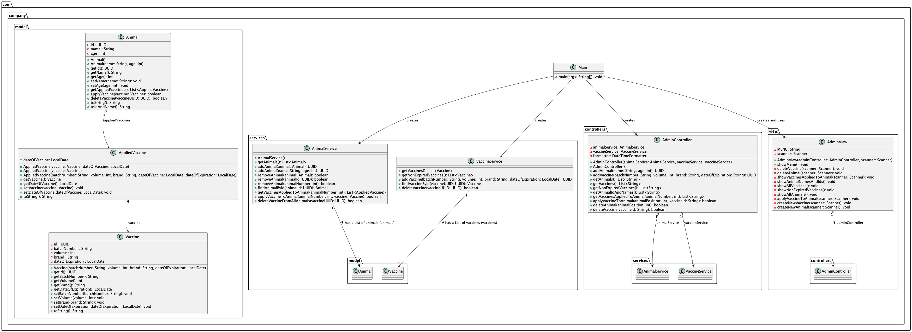

# Ejemplo Diagramas de clases y Listas en java

## Diagrama de clases

A continuación encontrará un diagrama de clases que representa la estructura de un sistema de información para una tienda de mascotas.
(Una representación más precisa puede ser encontrada en el [archivo `diagrama_clases.png`](assets/diagrama_clases.png))



Use este ejemplo a la hora de completar su proyecto. 
Recuerde que en las clases que se encuentran en este archivo, encontrará links que pueden servir de ayuda.

## Instrucciones para ejecutar el proyecto

Para ejecutar el proyecto, siga los siguientes pasos:

1. Clone el proyecto en su máquina local.
2. Abra el proyecto en su IDE favorito.
3. Ejecute el archivo `Main.java`.
4. El programa le mostrará el siguiente menú:
    ```text
   =========================================
   Welcome to the Animal Vaccination System
   =========================================
   
   Select a module to continue:

   1. Admin module (administrator operations, such as adding animals and vaccines)
   0. Exit

   ```
5. Seleccione el módulo 1 para ingresar al módulo de administración.
6. El programa le mostrará el siguiente menú:
   ```text
   =========================================
                  Administrator module
   =========================================
        
        Select an option to continue:
        
         1. Create new animal
         2. Create a new vaccine
         3. Apply vaccine to an animal
         4. Show all animals
         5. Show all vaccines
         6  Show vaccines applied to an animal
         7. Delete a vaccine
         8. Delete an animal
         0. Exit

   ```
7. Si desea, puede copiar el siguiente contenido para cargar datos de animales y vacunas (debe presionar la tecla enter después de pegar el contenido):
   ```text
   1
   1
   Paco
   1
   1
   Miauricio
   2
   1
   Charizandra
   3
   2
   MAY2020
   35
   Pfizer
   2022-05-02
   2
   JUN2022
   25
   Moderna
   2026-06-30
   2
   JAN2023
   45
   AstraZeneca
   2028-01-31
   4
   ```
8. A partir de aquí puede interactuar con el menú y probar las diferentes funcionalidades del programa.

## Posibles problemas al ejecutar el proyecto

1. Al abrir el proyecto, puede que intellij no haya detectado el SDK de Java. Para solucionarlo, haga clic en "File" -> "Project Structure" -> "Project" y seleccione la versión de Java que tiene instalada en su máquina.
